# Modul Tetapan Iklan

1. [Pengenalan Modul](#pengenalan-modul)
2. [Matrik Iklan](#matrik-iklan)
3. [Senarai Jenis Iklan](#senarai-jenis-iklan)
4. [Senarai Kategori Perolehan](#senarai-kategori-perolehan)
5. [Senarai Jenis Tender](#senarai-jenis-tender)

## Pengenalan Modul

Modul Tetapan Iklan adalah sebahagian daripada proses permohonan nombor perolehan (SISDANTS).   Jenis Iklan, Kategori Perolehan dan Jenis Tender adalah wajib untuk dimasukkan ke dalam sistem dan di matrikkan supaya pengguna dapat memohon nombor perolehan yang menepati piawaian.

## Matrik Iklan

| No   | Penerangan                                                   |
| :--- | :----------------------------------------------------------- |
| 1.   | 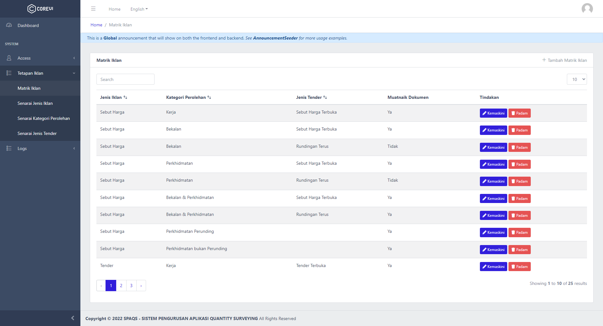 Senarai Matrik Iklan akan dipaparkan selepas pengguna menekan 'Matrik Iklan' di sidebar. Untuk menambah baru Matrik Iklan, tekan butang '+ Tambah Matrik Iklan' yang berada di atas kanan. Untuk mengemaskini maklumat sedia ada, tekan butang 'Kemaskini'. |
| 2.   | 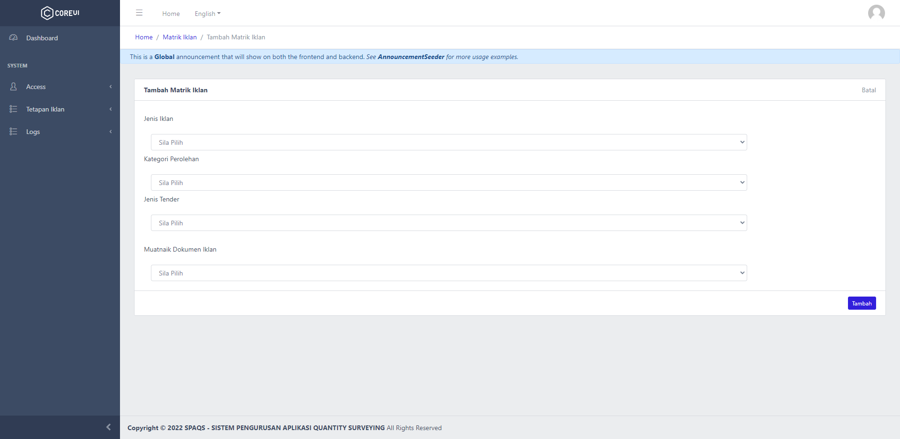 Pengguna perlulah memilih Jenis Iklan, Kategori Perolehan, Jenis Tender dan Muatnaik Dokumen Iklan.  Senarai Jenis Iklan, Kategori Perolehan dan Jenis Tender yang boleh dipilih adalah merujuk kepada maklumat yang telah dimasukkan di [Senarai Jenis Iklan](#senarai-jenis-iklan), [Senarai Kategori Perolehan](#senarai-kategori-perolehan), [Senarai Jenis Tender](#senarai-jenis-tender). Muatnaik Dokumen Iklan pula bertujuan untuk memastikan pengguna hanya boleh memuatnaik dokumen iklan sekiranya 'Ya' dipilih. (di SISDANTS)  Setelah memilih maklumat di 'dropdown', tekan butang 'Simpan'. |
| 3.   | 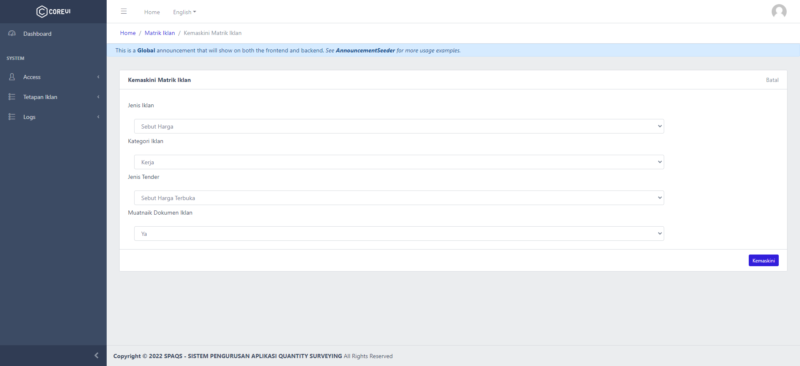 Pengguna boleh edit maklumat mengikut kesesuaian.  Tekan butang 'Kemaskini' untuk menyimpan data baharu. |

## Senarai Jenis Iklan

| No   | Penerangan                                                   |
| :--- | :----------------------------------------------------------- |
| 1.   | 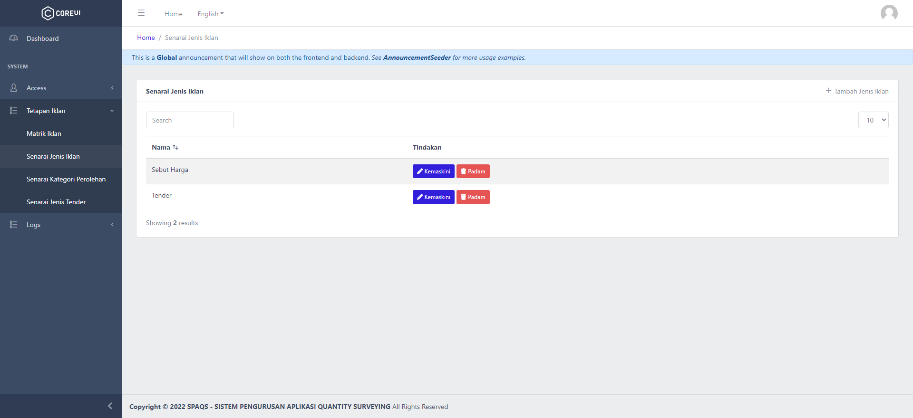 Senarai Jenis Iklan akan dipaparkan selepas pengguna menekan 'Senarai Jenis Iklan' di sidebar. Untuk menambah baru Jenis Iklan, tekan butang '+ Tambah Jenis Iklan' yang berada di atas kanan. Untuk mengemaskini maklumat sedia ada, tekan butang 'Kemaskini'. |
| 2.   | 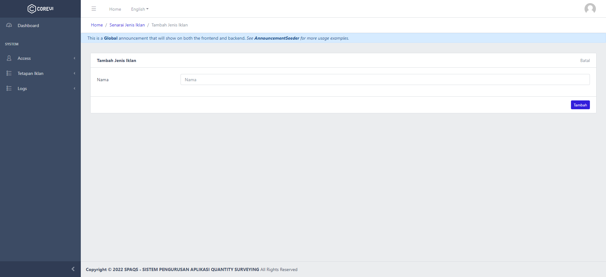 Setelah memasukkan maklumat, tekan butang 'Simpan'. |
| 3.   | 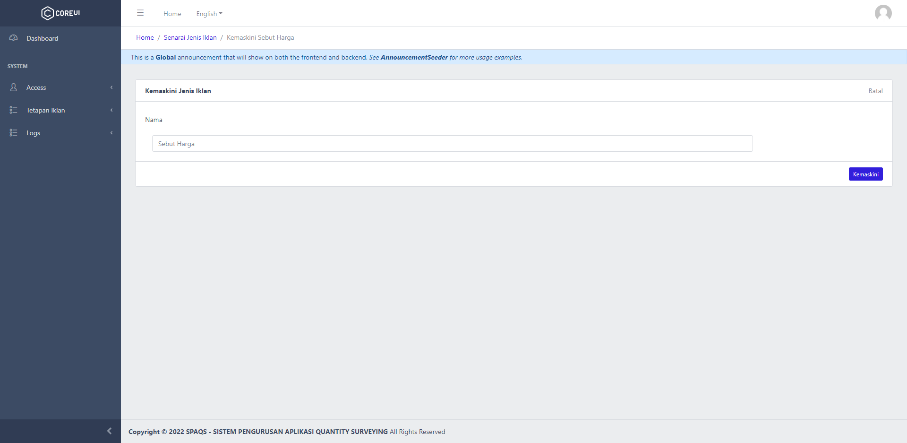 Pengguna boleh edit maklumat mengikut kesesuaian.  Tekan butang 'Kemaskini' untuk menyimpan data baharu. |

## Senarai Kategori Perolehan

| No   | Penerangan                                                   |
| :--- | :----------------------------------------------------------- |
| 1.   | 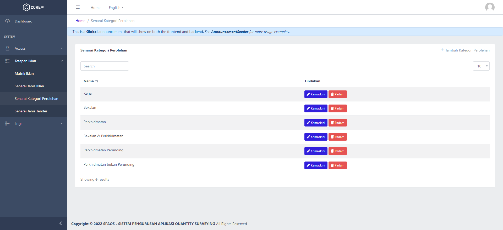 Senarai Kategori Perolehan akan dipaparkan selepas pengguna menekan 'Senarai Kategori Iklan' di sidebar. Untuk menambah baru Kategori Perolehan, tekan butang '+ Tambah Kategori Perolehan' yang berada di atas kanan. Untuk mengemaskini maklumat sedia ada, tekan butang 'Kemaskini'. |
| 2.   |  Setelah memasukkan maklumat, tekan butang 'Simpan'. |
| 3.   | 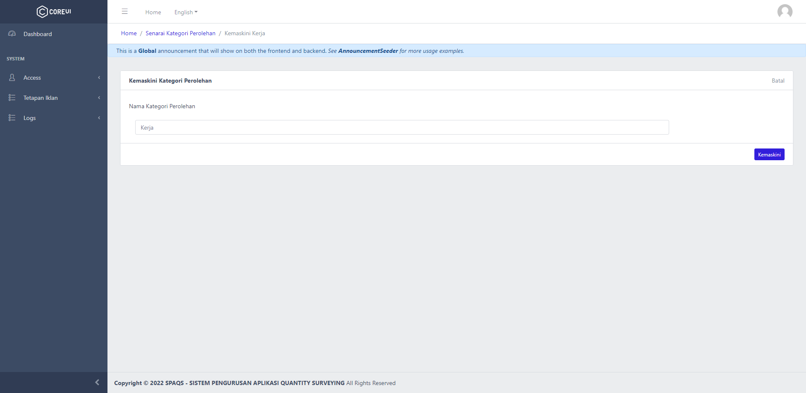 Pengguna boleh edit maklumat mengikut kesesuaian.  Tekan butang 'Kemaskini' untuk menyimpan data baharu. |

## Senarai Jenis Tender

| No   | Penerangan                                                   |
| :--- | :----------------------------------------------------------- |
| 1.   | 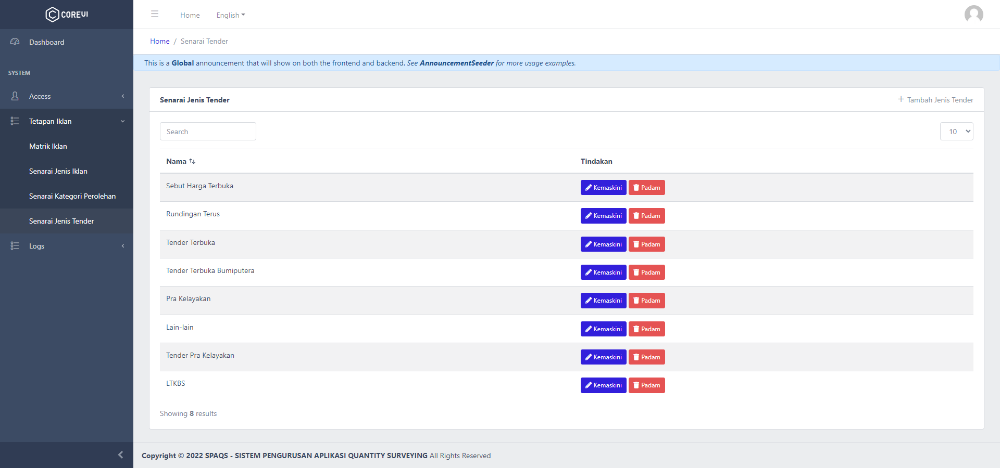 Senarai Jenis Tender akan dipaparkan selepas pengguna menekan 'Senarai Jenis Tender' di sidebar. Untuk menambah baru Jenis Tender, tekan butang '+ Tambah Jenis Tender' yang berada di atas kanan. Untuk mengemaskini maklumat sedia ada, tekan butang 'Kemaskini'. |
| 2.   | 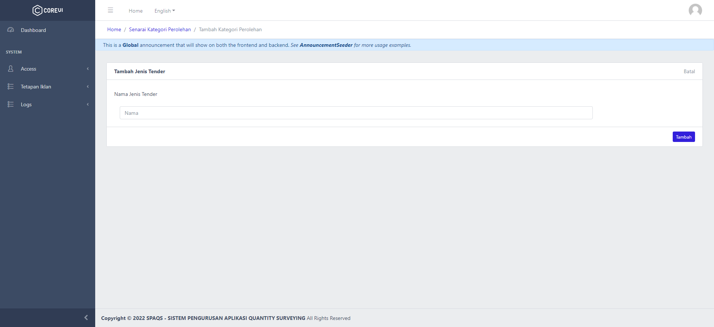 Setelah memasukkan maklumat, tekan butang 'Simpan'. |
| 3.   | 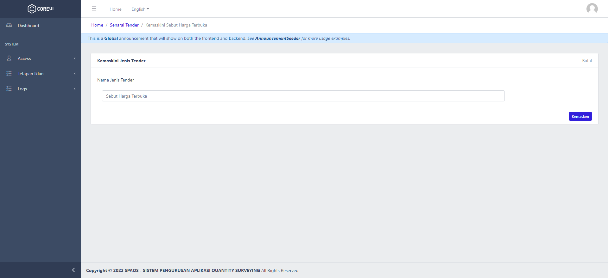 Pengguna boleh edit maklumat mengikut kesesuaian.  Tekan butang 'Kemaskini' untuk menyimpan data baharu. |