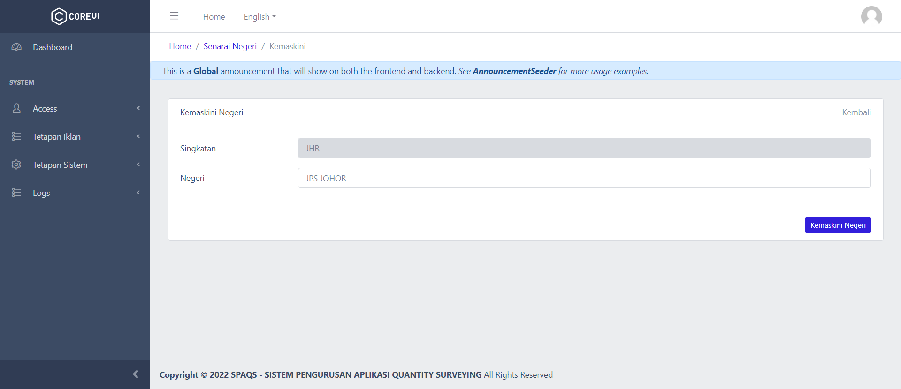
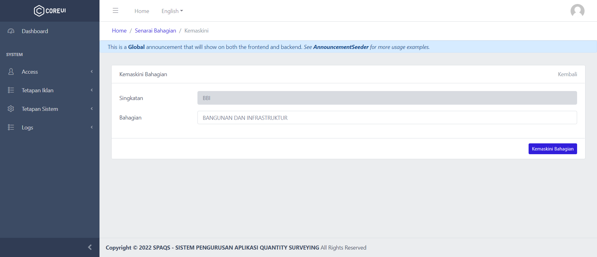

# Modul Tetapan Iklan

1. [Pengenalan Modul](#pengenalan-modul)
2. [Senarai Negeri](#negeri)
3. [Senarai Bahagian](#bahagian)
4. [Alamat Tender](#alamat-tender)

## Pengenalan Modul

Modul Tetapan Sistem adalah sebahagian daripada proses permohonan nombor perolehan (SISDANTS).   Senarai Negeri, Senarai Bahagian dan Alamat Tender adalah wajib untuk dimasukkan ke dalam sistem supaya pengguna dapat memohon nombor perolehan yang menepati piawaian.

## Senarai Negeri

| No   | Penerangan                                                   |
| :--- | :----------------------------------------------------------- |
| 1.   |  Senarai Negeri akan dipaparkan selepas pengguna menekan 'Senarai Negeri' di sidebar. Untuk menambah baru Negeri, tekan butang '+ Tambah Negeri' yang berada di atas kanan. Untuk mengemaskini maklumat sedia ada, tekan butang 'Kemaskini'. |
| 2.   |  Pengguna perlulah mengisi singkatan nama negeri dan nama negeri.   Setelah mengisi semua maklumat, tekan butang 'Simpan'. |
| 3.   |  Pengguna boleh edit maklumat mengikut kesesuaian.  Tekan butang 'Kemaskini' untuk menyimpan data baharu. |

## Senarai Bahagian

| No   | Penerangan                                                   |
| :--- | :----------------------------------------------------------- |
| 1.   |  Senarai Bahagian akan dipaparkan selepas pengguna menekan 'Senarai Bahagian' di sidebar. Untuk menambah baru Jenis Bahagian, tekan butang '+ Tambah Bahagian' yang berada di atas kanan. Untuk mengemaskini maklumat sedia ada, tekan butang 'Kemaskini'. |
| 2.   |  Setelah memasukkan maklumat, tekan butang 'Simpan'. |
| 3.   |  Pengguna boleh edit maklumat mengikut kesesuaian.  Tekan butang 'Kemaskini' untuk menyimpan data baharu. |

## Alamat Tender

| No   | Penerangan                                                   |
| :--- | :----------------------------------------------------------- |
| 1.   |  Senarai Kategori Perolehan akan dipaparkan selepas pengguna menekan 'Senarai Kategori Iklan' di sidebar. Untuk menambah baru Kategori Perolehan, tekan butang '+ Tambah Kategori Perolehan' yang berada di atas kanan. Untuk mengemaskini maklumat sedia ada, tekan butang 'Kemaskini'. |
| 2.   |  Setelah memasukkan maklumat, tekan butang 'Simpan'. |
| 3.   |  Pengguna boleh edit maklumat mengikut kesesuaian.  Tekan butang 'Kemaskini' untuk menyimpan data baharu. |

## 
